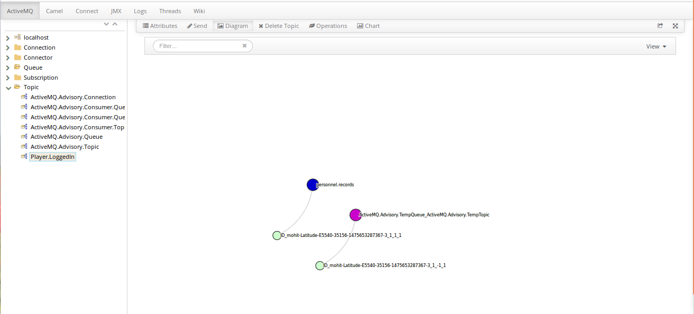
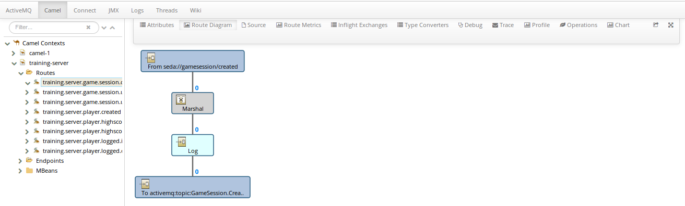

Hawtio
======

Hawtio is a
* light weight
* modular
* HTML5 based Web console
* It has lots of Plugins
* Manage Java Stuff
* Server side dependency on Jolokia

It can be downloaded from [the official website](http://hawt.io/)

###Plugins
Following are the plugins available in hawtio (they may differ on your machine)

###ActiveMQ Plugin
ActiveMQ plugin enables us to view and execute existing Message Queues.
We can play around with message queues, change attributes, create diagrams and charts for analysis.

###Camel Plugin
Camel plugin enables us to analyze existing routes, create diagrams and debug camel routes.

